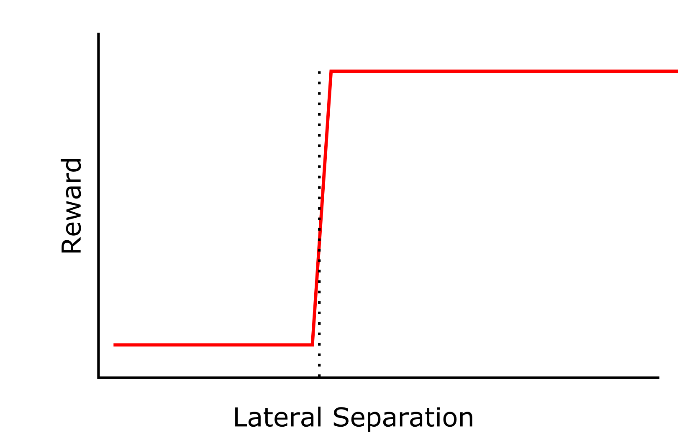

## Markov Decision Processes

This chapter dealt with finite Markov Decision Processes (MDP). It focuses on the interplay between the agent and the environment. The overall aim is to maximise the reward by having the agent act on the environment and change it's state. 
One thing to note is the Markov property, that is that we only need the current state to define what will happen in the future of the system, and that the previous states do not have an effect. This would be true for the NATS example below (via judicious choice of parameters to model), or the result of rolling dice or tossing coins, but not true for something like a game of poker, as the state of the system (which cards are left) does depend on what has happened before, and as not all available cards are known, we cannot say that the system at time t is independent of its history.
There's actually a lot to process in this; in this case we can have episodic tasks (that have a definite end) and continuing tasks.
An example of an episodic task would be managing two aircraft through a specific sector of airspace. Which is what is happening with the NATs project.

### 3.1 NATS example 

One of the projects I am working on is with NATS and is looking at generating a digital twin of UK airspace and using it to test agents in efficient ways to manage aircraft, just as an ATCO would. I think this example typifies an episodic MDP:
The environment contains things such as, fixes, aircraft, routes. 
We can define metrics to measure agent performance by quantifying features such as aircraft separation, time spent on posted route, fuel efficiency. For each one of these metrics, a reward function needs to be defined. This is not trivial.
In one second increments (in the NATS) example, the agent will give information to the aircraft - say increase flight level to 140 - and the environment will update accordingly and send back the state. The reward can then be calculated.
In a first iteration the main focus is on avoiding a 'loss of separation' (crash). There are lateral and vertical limits on the aircraft separation.

This image is an example of a reward function that could be used for the lateral separation. For high separation the reward is constant, say 0 in this case. At some point the threshold is crossed, in the case of NATS the lateral separation needs to be something like 5 nmi. This is shown as a dashed line on the graph. There is a sharp decrease in the reward function at this threshold before the function plateaus again. This may be okay, but in this context having planes 4.9 nmi away from each other is 'as bad' as having planes 0.1 nmi away from each other, instinctively this feels wrong. Perhaps the function could look like this:

We have the same behaviour above 5 nmi, which makes sense, we don't want to send aircraft 100's of nmi away from each other. But it also means that there is less 'punishment' for an aircraft that is 4.9 nmi from another, than there is for one that is 0.1 nmi from another, hence incentivising the agent to move the aircraft as far away from each other as possible, even if they end up less than 5 nmi away from each other.

#### 3.1.1 Rewards

Here the reward would be the sum of all rewards for each step as the aircraft traversed the airspace. In the example above the only real impetus is to keep the lateral distance of aircraft above 5 nmi, however we can add in additional reward functions that take into account fuel economy or deviation from plotted route (or both). This would alter the optimal action that could be taken. If we also care about fuel economy for example, as long as the planes stay more than 5 nmi apart the agent's optimal action will then be to minimise fuel usage. But here's where we come against an interesting 'problem'. While maintaining separation is the most important thing. How to we weight other concerns? If we accidentally produce a reward function that is more weighted on fuel efficiency the 'optimal' action/state may be to have three aircraft inhabit the same volume of space!

#### 3.1.2 End of the Episode

Just to point out that the NATs example lends itself nicely to being an episodic problem. Once the aircraft have left the sector then the simulation is over. However, in order to maintain continuity between continuous and episodic scenarios, the final step of an episode can be thought of as a step to 'keep everything as is' with a reward of zero. This is the absorbing state.

#### 3.1.3 Markov Property?

A comment could be made that the state of the environment is dependent on its history (say if we are tracking the amount of fuel left in a plane) but actually it doesn't matter how the aircraft ran down its fuel, only that at time t, the fuel level is known. Which it is.

### 3.2 Interatomic Potentials

Another way in which the examples in the book corespond to my research history, is the search for viable interatomic potentials to describe group 2 oxides.
In computational chemistry it is useful to have a computationally inexpensive way to model the interation between ionic pairs in solids. One of these ways is via a Buckingham interatomic potential. Where there are three individual parameters to fit, A, B, and C (although C is usually calculated as a constant and can be omitted). We can use a relatively inexpensive program, GULP, to calculate the energy of a bulk given a combination of the two interatomic potential parameters. This map (shown below) is similar to the gridworld example from chapter 3.

Energy landscape of bulk MgO with changing A, and B, Buckingham potential parameters (IP1 and IP2 respectively).

 Each IP1/IP2 pair describes the state of the environment and the colour contour map is the value function for that point. The aim would be to minimise the value function 